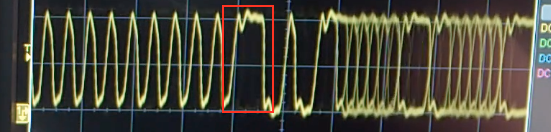

* /dev/ttyACM devices are for [cellular modems](https://www.rfc1149.net/blog/2013/03/05/what-is-the-difference-between-devttyusbx-and-devttyacmx/).
* Is a Linux process hogging a serial port that you wish you could interact with in its currently running state? Check it out with `strace` and then if you want to steal the port get [reptyr](https://github.com/nelhage/reptyr). You can re-parent a running process onto a new terminal (yours!). You can then grab the serial port that process used to use for yourself. Likely you could use `socat` to fork off a copy of the running traffic. [Details here.](https://blog.nelhage.com/2011/02/changing-ctty/).
* Hacker Pro-Tip: Have a silent serial port? After you get root `cat /dev/random > /dev/ttyS0` (or whatever) to make some noise on the port. Then probe without having to hope there's something on the port.
* Set baud rate `stty 19200 -F /dev/ttyS1`
* Make a login macro with burp:
    - See this [article](http://fvaahe.com/creating-a-login-macro-for-burp-suite/)
    - Create new macro (Project Options -> Session -> Macro) to do a login
    - Make a new macro to make an innocuous request to check and see if session is valid.
    - You may need to disable using existing cookies for the request because you want a new cookie
    - In the "Use cookies from Burp's cookie Jar" session rule add a new Rule Action to check if session is valid
    - Run the check session macro, if you made one
    - Set check on session validity
    - Set to run login macro if not logged in
* Use Burp to test and see if login is invalidating old session tokens.
    - Set up a login macro. Make sure to configure the macro to NOT use old session cookies. You want a brand new one.
    - Set up a Session Handling Rule for Intruder that uses this macro so that before each Intruder request you log in.
    - Disable the standard "Use Cookies from Burp's Cookie Jar" Session Handling Rule for Intruder
    - Set up Intruder with a request, stocked with a newly valid collected session, for an authenticated URL
    - Make modify the request to include a `reqnumber=§1§` cookie to hold the payload
    - Set the payload to count from 1 to N
    - Set concurrent requests to 1
    - Launch the attack
    - Check the Logger++ view to make sure you are alternating between login and intruder requests and that the login request is always getting a new cookie and that the intruder request continues to use the old one.
    - A proper app should do a server invalidation on LRU cookies as new ones are invalidated.
* You can [encode IP addresses all sorts of weird ways](http://www.pc-help.org/obscure.htm) to obscure them from filters.
* Take care not to melt your SIM card with a heat gun.
* Some USB devices support [Device Firmware Upload](http://processors.wiki.ti.com/index.php/Linux_Core_U-Boot_User's_Guide#Writing_to_NAND_via_DFU) (and download) for reading and writing from NAND.
* Wrong terminal dimensions on a serial line? `export TERM=linux ; stty rows <ROWS> cols <COLS` will probably fix it. ([SO](http://unix.stackexchange.com/questions/106644/how-to-change-the-width-of-remote-serial-console))
* If you copy files out of a Time Machine backup directory they will have some weird extended attributes. View with `ls -le`. Remove with `chmod -RN /path/to/directory`.
* VMWARE shared FS:
    * Install `open-vm-tools`
    * Mount with: `vmhgfs-fuse -o auto_unmount -o uid=1001 -o gid=1002 .host:/<share> <path>`
* [`mutt` + GMail on the Mac](https://medium.com/@stessyco/gmail-from-the-command-line-with-mutt-mac-os-x-92d047bcd74f#.f40ny3mfn)
* Saleae firmware extraction from SPI: Capture, SPI decoder, save to text file. @scanlime
* Slow hot air removal? Add leaded solder + flux to lower melting point. Chip-Quik if needed. @scanlime
* Use a low-speed USB device like a keyboard to aid in differentiating D+/D-. USB 2.0 HS has a floating idle-state which requires a scope to identify. @scanlime
* [USB HS D+/D- differentiation](https://electronics.stackexchange.com/questions/73295/in-a-usb-cable-is-it-ok-to-swap-the-d-and-d-wires). D+ is the first picture, D- is the second. The key differentiator is the polarity of the first pulse after the sync. @scanlime

